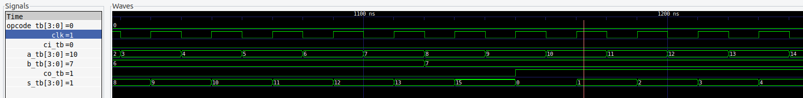
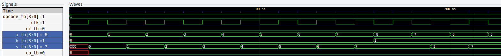
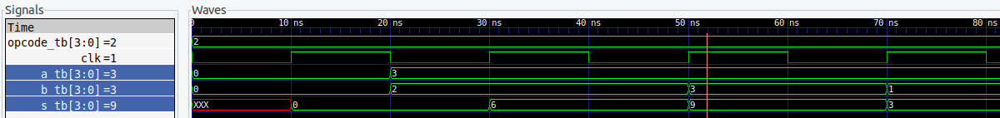
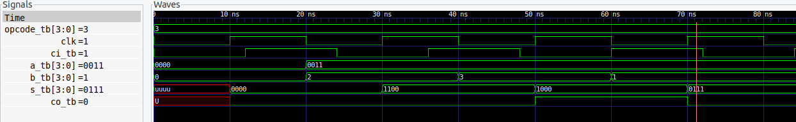
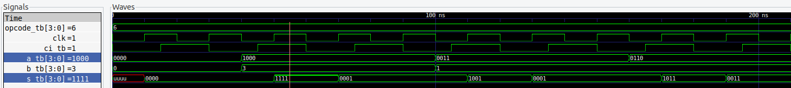
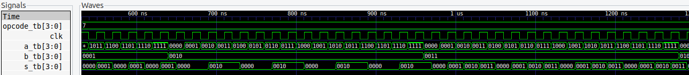

# Unidad Aritmética Lógica (ALU)

Se implementó una ALU de 4 bits con 14 instrucciones. El código VHDL permite escalar la ALU a cualquier número par de bits.
Las instrucciones de la ALU son:
- **Suma**: Suma dos operandos y almacena el resultado en el registro de resultado mas un carry. Admite un carry in.
- **Resta**: Resta dos operandos y almacena el resultado en el registro de resultado mas un carry. Admite un carry in.
- **Multiplicación**: Multiplica dos operandos y almacena el resultado en el registro de resultado. Los operandos son de la mitad de bits que los de la ALU.
- **Desplazamiento no signado a la izquierda**: Desplaza un operando a la izquierda y almacena el resultado en el registro de resultado mas un carry. Admite un carry in.
- **Desplazamiento no signado a la derecha**: Desplaza un operando a la derecha y almacena el resultado en el registro de resultado mas un carry. Admite un carry in.
- **Desplazamiento signado a la izquierda**: Desplaza un operando a la izquierda y almacena el resultado en el registro de resultado mas un carry. Admite un carry in.
- **Desplazamiento signado a la derecha**: Desplaza un operando a la derecha y almacena el resultado en el registro de resultado mas un carry. El registro de carry in se utiliza como indicador de signo para permitir un bit mas.
- **AND**: Operación lógica AND entre dos operandos y almacena el resultado en el registro de resultado.
- **OR**: Operación lógica OR entre dos operandos y almacena el resultado en el registro de resultado.
- **XOR**: Operación lógica XOR entre dos operandos y almacena el resultado en el registro de resultado.
- **NAND**: Operación lógica NAND entre dos operandos y almacena el resultado en el registro de resultado.
- **NOR**: Operación lógica NOR entre dos operandos y almacena el resultado en el registro de resultado.
- **XNOR**: Operación lógica XNOR entre dos operandos y almacena el resultado en el registro de resultado.
- **NOT**: Operación lógica NOT entre un operando y almacena el resultado en el registro de resultado.

## Esquematico

## Simulaciones

### SUMA
En la siguiente figura se observa la simulación de una suma y el cursor esta en una situación de desborde causando un carry out en uno.

### RESTA
En la siguiente figura se observa la simulación de una resta. Observe que admite valores negativos.

### MULTIPLICACIÓN
En la siguiente figura se observa la simulación de una multiplicación. Los valores admitidos para la ALU simulada (4 bits) son operandos de 2 bits.

### DESPLAZAMIENTOS
A continuación se muestran los desplazamientos implementados en la ALU. Los desplazamientos a la izquierda signados y no signados se comportan de la misma manera y se pueden observar en la siguiente imagen. Observe que admite un carry in y tiene carry out.

El desplazamiento signado a la derecha utiliza el carry in como indicador de signo para permitir un bit mas. En la siguiente figura se puede observar su comportamiento.

### OPERACIONES LÓGICAS

A continuación se muestra el comportamiento de la operación AND. Ninguna de las operaciones lógicas usa los carries.

### USO DE RECURSOS

